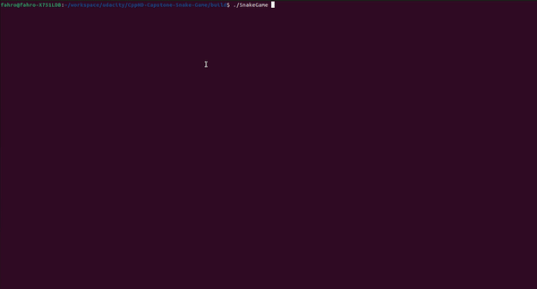

# CPPND: Capstone Snake Game Example

This is a starter repo for the Capstone project in the [Udacity C++ Nanodegree Program](https://www.udacity.com/course/c-plus-plus-nanodegree--nd213). The code for this repo was inspired by [this](https://codereview.stackexchange.com/questions/212296/snake-game-in-c-with-sdl) excellent StackOverflow post and set of responses.

The Capstone Project gives you a chance to integrate what you've learned throughout this program. This project will become an important part of your portfolio to share with current and future colleagues and employers.

In this project, you can build your own C++ application or extend this Snake game, following the principles you have learned throughout this Nanodegree Program. This project will demonstrate that you can independently create applications using a wide range of C++ features.

## Dependencies for Running Locally
* cmake >= 3.7
  * All OSes: [click here for installation instructions](https://cmake.org/install/)
* make >= 4.1 (Linux, Mac), 3.81 (Windows)
  * Linux: make is installed by default on most Linux distros
  * Mac: [install Xcode command line tools to get make](https://developer.apple.com/xcode/features/)
  * Windows: [Click here for installation instructions](http://gnuwin32.sourceforge.net/packages/make.htm)
* SDL2 >= 2.0
  * All installation instructions can be found [here](https://wiki.libsdl.org/Installation)
  >Note that for Linux, an `apt` or `apt-get` installation is preferred to building from source. 
* gcc/g++ >= 5.4
  * Linux: gcc / g++ is installed by default on most Linux distros
  * Mac: same deal as make - [install Xcode command line tools](https://developer.apple.com/xcode/features/)
  * Windows: recommend using [MinGW](http://www.mingw.org/)

## Basic Build Instructions

1. Clone this repo.
2. Make a build directory in the top level directory: `mkdir build && cd build`
3. Compile: `cmake .. && make`
4. Run it: `./SnakeGame`.

## Introduced features to the project

* Obtaining and verifying username from the console input and then creating Player class instance.
* Obtaining and verifying game level from the console input. There are  the 3 levels available: beginner, intermediate and advanced. User must select one of these 3 levels upon selection of the username.
* Maintaining highest scores list for every user per every level in highest_scores.txt file. Example of the content for this file:
James beginner:9 medium:10 advanced:8
Fabian beginner:0 medium:8 advanced:6
* For intermediate and advanced levels, obstacles are generated to make game more challenging.
  * For beginner level, no obstacles are generated at all.
  * For intermediate level, obstacles are randomly generated.
  * For advanced level, obstacles are generated in front of the snake.
* Introducing SnakeHunter class. As its name suggests, instance of this class has one and only task - hunting the snake. Entire process of hunting the snake happens in a separate thread.

## Required rubric points

* Loops, Functions, I/O
  * Using different types of loops throughout entire program.
  * Opening, reading and parsing highest_scores.txt file.
  * Accepting and veryfing user input (for username and game level).
* Object Oriented Programming
  * Following new classes have been introduced: Player, ObstaclesGenerator, BeginnerObstaclesGenerator, MediumObstaclesGenerator and AdvancedObstaclesGenerator.
  * Classes like Player, MediumObstaclesGenerator and AdvancedObstaclesGenerator utilize member initialization lists to initialize their members.
  * ObstaclesGenerator represents base class (interface) which is inherited (implemented) by the BeginnerObstaclesGenerator, MediumObstaclesGenerator and AdvancedObstaclesGenerator.
  * normalizePoint function has been overloaded for integers and floats.
* Memory Management
  * Using references in function declarations: e.g. in a function PersistPlayersToFile, vector of players is passed by const ref to avoid copying data.
  * On multiple ocassions std::move is used to move data instead of copying them (e.g. constructor of the Player class).
  * To achieve polymorphism and execute correct version of the ObstaclesGenerator::CreateObstacle method, smart pointers are used and they are created inside the factory function ObstaclesGenerator::ObstaclesFactory.
* Concurrency
  * Thread for generating obstacles has been introduced.
  * Thread for hunting the snake has been introduced as well.
  * Since these 3 threads (main thread, thread for generating obstacles and thread for hunting the snake) share some data (food, snake, obstacles etc.) mutexes are used to protect access to these shared resources from these 3 threads simultaneously. Since the usage of the mutexes directly in methods of Game class became too complex and not maintainable at all, I was looking for more convenient solution which should allow me easier access to these shared resources. In the book called "Concurrency with Modern C++" from author Rainer Grimm, I found one very convenient approach called Thread-Safe Interface. After, realising that this type of design pattern could be applied for my problem I implemented new class called GameResources which actually implements this Thread-Safe Interface approach.
  * Thread for hunting the snake looks for the next position of the snake hunter which should bring him closer to the snake. This thread can only be executed once when the snake has made its move. Lookup algorithm which finds the closest path to the snake is actually BFS (breadth first search). To ensure that the thread for hunting the snake is executed only upon snake has made a move, condition variable has been used (i.e. main thread which controls the snake movement will notify the thread in which snake hunter tries to get closer to the snake and then, inside this thread calculation for the closest path begins).

## CC Attribution-ShareAlike 4.0 International

Shield: [![CC BY-SA 4.0][cc-by-sa-shield]][cc-by-sa]

This work is licensed under a
[Creative Commons Attribution-ShareAlike 4.0 International License][cc-by-sa].

[![CC BY-SA 4.0][cc-by-sa-image]][cc-by-sa]

[cc-by-sa]: http://creativecommons.org/licenses/by-sa/4.0/
[cc-by-sa-image]: https://licensebuttons.net/l/by-sa/4.0/88x31.png
[cc-by-sa-shield]: https://img.shields.io/badge/License-CC%20BY--SA%204.0-lightgrey.svg
